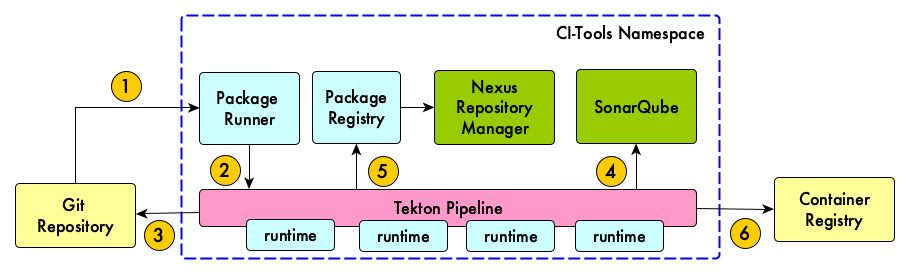

# Getting in Started with OpenShift

This document contains instructions on how to setup OpenShift container platform to use Tekton pipelines based Artisan automation.

It provides the list of prerequisites such as deployment of the Artisan Registry, creation of required ServiceAccount, Secrets etc.

This setup is required before executing artisan packages in OpenShift.

If you have already done this skip to the "[How to Build & Run Artisan Packages](https://github.com/gatblau/artisan/tree/master/package/app#how-to-run-the-packages)" section.

## Services Overview

The following image shows the various services required to run Artisan automation in Kubernetes:



A typical CI workflow follows:

1. Git commit sent to runner
2. Runner starts pipeline
3. Git repository cloned
4. Application code quality report uploaded to Sonar
5. Application package pushed to package registry
6. Application container image pushed to container registry

## Table of contents


<!--ts-->
   * [Setup Nexus Repo](#Setup-Nexus-Repo)
      * [Prerequisites](#Prerequisites)
      * [Create Nexus Repo Application](#Create-Nexus-Repo-Application)
      * [Expose Route for Nexus Repo](#Expose-Route-for-Nexus-Repo)
      * [Create Nexus Repository](#Create-Nexus-Repository)
   * [Setup Artisan Registry](#Setup-Artisan-Registry)
   * [Setup Artisan Runner](#Setup-Artisan-Runner)
   * [Setup SonnarQube in OpenShift](#Setup-SonnarQube-in-OpenShift)
      * [Generate Token](#Generate-Token)
   * [Install the Artisan CLI in the control machine](#Install-Artisan-CLI-in-control-machine)
   * [Configure a non-privileged user for Artisan & generate PGP keys](#Configure-non-privileged-user-for-Artisan-&-generate-keys)
   * [CI/CD using Openshift Pipelines (Tekton-CD)](#CICD-using-Openshift-Tekton-Pipeline)
      * [Install Tekton Pipeline Operator](#Install-Tekton-Pipeline-Operator)
      * [Create Pipeline Registry Secrets](#Create-Pipeline-Registry-Secrets)
<!--te-->
## Setup Nexus Repository

Nexus Repository is the central source of control to efficiently manage all binaries and build artifacts across your DevOps pipeline. 

### Prerequisites

1) Install Nexus Operator in openshift namespace
   - Switch to Administrator Perspective
   - Open OperatorHub -> Search for "Nexus Repository Operator"
   - Select namespace & click on install button

2) Create separate Service Account for Nexus Repository

    User Management -> Service Accounts -> Create ServiceAccount

3) Now attach custom scc

```bash
oc apply -f nexus-custom-scc.yaml

oc adm policy add-scc-to-user scc-nexus -z <nexus-service-account>
```

### Create Nexus Repo Application

1) Switch to Administrator Section

2) Click on Operators & select Nexus Repository Operator

3) Click on NexusRepo tab -> Create NexusRepo

4) Select yaml view -> change app name 

5) Change NEXUS_SECURITY_RANDOMPASSWORD to true

6) Click on Create Button

### Expose Route for Nexus Repo

1) Switch to Administrator Section

2) Click on Networking -> Routes -> Create Route -> Enter route name -> From service list select nexus repo

3) Enable security route -> Termination Type=Edge -> Insecure Traffic=Redirect 

4) Click on Create button 

Now we have to change the ServiceAccount as by default application gets installed inside the Default SA. 

Click on Nexus repo app -> Click on Actions -> Select Edit Deployment -> Switch to yaml section & add below code under template -> spec

```bash
spec:
  serviceAccountName: <nexus-service-account>
```

### Create Nexus Repository

1) Now open nexus console & follow the on screen instructions to setup repo

2) Click repositories -> Create Repository -> Select Raw Hosted ->  Enter Name=artisan & click on Create Repository button  

### Setup the Artisan Registry

Artisan Registry in openshift acts like a proxy for the nexus repository that we have created in the previous step. Here we just need to create an artisan registry application.

1) *oc create -f ArtisanRegistry_OpenshiftCatalogTemplate.yaml*

2) Switch to Developer section

3) Click on Add -> In catalog, search for Artisan Registry template

4) Pass all required parameters. Refer the below table for parameter values

5) Click on Create button

Environment variables required by the Artisan Registry image:

| item | possible vale | description |
|---|---|---|
| APPLICATION_NAME | - | Application name |
| OXA_METRICS_ENABLED | - true <br> - false | Enable Metrix |
| OXA_SWAGGER_ENABLED | - true <br> - false | Enable Swagger UI |
| OXA_HTTP_UNAME | - | Nexus Registry Username |
| OXA_HTTP_PWD | - | Nexus Registry Password |
| OXA_HTTP_BACKEND | Nexus3 | Backend name |
| OXA_HTTP_BACKEND_DOMAIN | - | Nexus App URI |
| OXA_HTTP_UPLOAD_LIMIT | 30 | Artefact Upload Limit |

## Setup the Artisan Flow Runner

The *Artisan Flow Runner* is used to run artisan flows as Tekton pipelines in Kubernetes. It creates Tekton Pipeline resources so that there is no need to install tkn cli on the host machine.

1) Create **artisan-runner** Service Account

2) Create artisan-runner template

```bash
oc create -f ArtisanRunner_OpenshiftCatalogTemplate.yaml
```

2) Switch to Developer section

3) Click on Add -> In catalog, search for Artisan Runner template

4) Pass all required parameters. Refer the below table for parameter values

5) Click on Create button

Attach RBAC policy to the artisan-runner service account. The policy is required by the runner to create tekton pipeline resources in Openshift.

```bash
oc apply -f art-runner-rbac.yaml
```

| item | possible vale | description |
|---|---|---|
| APPLICATION_NAME | artisan-runner | Application name |
| OXA_HTTP_UNAME | - | Artisan Runner Username |
| OXA_HTTP_PWD | - | Artisan Runner Password |
| ARTISAN_RUNNER_IMAGE | quay.io/gatblau/artisan-runner | Artisan Runner Docker Image Name |

## Setup SonnarQube in OpenShift

SonarQube is an open-source platform developed by SonarSource for continuous inspection of code quality to perform automatic reviews with static analysis of code to detect bugs, code smells, and security vulnerabilities on 20+ programming languages.

It is used by CI pipelines in the standard package library.

To set it up in OpenShift:

1) oc create -f SonarQube_OpenshiftCatalogTemplate.yaml

2) Switch to Developer section

3) Click on Add -> In catalog, search for SonarQube template

4) Pass all required parameters. Refer the below table for parameter values

5) Click on Create button

| item | possible vale | description |
|---|---|---|
| APPLICATION_NAME | sonarqube | Application name |
| SONARQUBE_IMAGE | docker.io/library/sonarqube | SonarQube Docker Image Name |

## Generate Token

A Sonar Token is required for login to the Sonar Dashboard without using default creds.

1) Click on Administrator -> My Account -> Security 
2) Under *Generate Token* section enter any name
3) Click on the *Generate* button. 
4) Save token with you.

## Install the Artisan CLI in the control machine

This is the machine where the administrator will create the pipelines.

The set it up in Linux:

```bash
art open -u=<ART_REG_USER>:<ART_REG_PWD> <ART_PACKAGE_NAME>
```

Now copy art cli binary to /usr/bin/ folder

```bash
cp art /usr/bin/
```

Validate installation by using the below command

```bash
art -v
```

## Configure a non-privileged user for Artisan & generate PGP keys

It's always good practice to execute commands with minimal permissions.

Artisan will not run any function that requires a runtime as a privileged user and therefore, you will need to create a non-privileged user to run the CLI.

```bash
# Create runtime group
groupadd -g 100000000 -o runtime

# Create runtime user & add to group
useradd -u 100000000 -G runtime runtime

# Give docker permission to runtime user
usermod -aG docker runtime

```

**NOTE**: *the name of the group and user created above is not important. However, the gid and uid must be set to `100000000`. As runtimes run under the `runtime` user, it is recommended the name of the group and user is aligned with this convention.*

1) Generate a Cryptographic Signature Key-Pair. Here the private key is used for signing the package and the public key is used to verify the package signature.

```bash
# instruct Artisan to create a PGP key-pair with default settings (if you want to know what they are, inspect the content of the generated keys)
art pgp gen .
```

2) Import the public & private keys into the Artisan local registry as follows:

```bash
# import the private key
art pgp import -k=true root_rsa_key.pgp

# import the public key
art pgp import -k=false root_rsa_pub.pgp
```

## CI/CD using Openshift Pipelines (Tekton-CD)

OpenShift Pipelines is a cloud-native continuous integration and delivery (CI/CD) solution for building pipelines using Tekton. Tekton is a flexible Kubernetes-native open-source CI/CD framework which enables automating deployments across multiple platforms (Kubernetes, serverless, VMs, etc)

## Install the Tekton Pipeline Operator

Install Tekton Pipeline Operator in openshift namespace
   - Switch to Administrator Perspective
   - Open OperatorHub -> Search for "Tekton Pipeline Operator"
   - Select namespace & click on install button

### Create Pipeline Registry Secrets

**NOTE**: *In this example, a Gitlab repository and registry are used*.

Create pipeline gitlab secrets & secrets to pull docker image from gitlab registry to deploy application.

```bash
# Add gitlab creds in secrets-pipeline.yaml file & Create pipeline secrets
oc create -f secrets-pipeline.yaml

# Create secrets to pull docker image from the gitlab registry
oc create secret docker-registry <secret_name1> --docker-server=registry.gitlab.com  --docker-username=<gitlab_uname> --docker-password=<gitlab_user_pwd>

oc create secret docker-registry <secret_name2> --docker-server=gitlab.com  --docker-username=<gitlab_uname> --docker-password=<gitlab_user_pwd>
```

After creating secrets we need to link them to the service account under which applications are running.

```bash
# Link secret to the pipeline service account
oc secrets link pipeline pipeline-gitlab-secret

# Link secrets to the default service account
oc secrets link default <secret_name1> --for=pull
oc secrets link default <secret_name2> --for=pull
```

We are done with the Openshift Setup required to create Tekton Pipelines & Generate Code using artisan packages in the standard library. 

Now [CLICK HERE](https://github.com/gatblau/artisan/tree/master/package/app#how-to-run-the-packages) to know more about How to build & run the packages.
